# TaxBD MongoDB Data Architecture & Regulatory Schema

## 🏛️ Core Principles

1. **Zero Hardcoded Tax Rules**: Tax rules, brackets, exemption ceilings, deduction formulas, and rebate percentages must **NEVER** be hard-coded into frontend UI components. All calculation parameters are fetched dynamically from MongoDB via the Express REST API.
2. **Multi-Year Assessment Support**: The schema supports historical, current, and upcoming assessment years (`2023-2024`, `2024-2025`, `2025-2026`, `2026-2027`).
3. **100% Regulatory Source Traceability**: Every individual tax rule, slab, rebate cap, deduction formula, and minimum tax rate contains a mandatory `sourceId` foreign key referencing an official `TaxSource` record from the **National Board of Revenue (NBR)** or Parliament Gazette.
4. **Administrative Auditability**: Modifications to tax rules are logged in `AdminAuditLog` with before/after state diffs and timestamps.

---

## 📊 Entity Relationship Diagram

```mermaid
erDiagram
    TaxYear ||--o{ TaxSlab : "contains progressive slabs"
    TaxYear ||--o{ TaxThreshold : "defines category limits"
    TaxYear ||--o{ DeductionRule : "defines allowable deductions"
    TaxYear ||--o{ TaxRebateRule : "defines Sec 78 rebates"
    TaxYear ||--o{ MinimumTaxRule : "defines location minimums"
    TaxYear ||--o{ SurchargeRule : "defines net wealth tiers"
    
    TaxSource ||--o{ TaxSlab : "statutory authority (sourceId)"
    TaxSource ||--o{ TaxThreshold : "statutory authority (sourceId)"
    TaxSource ||--o{ TaxpayerCategory : "statutory authority (sourceId)"
    TaxSource ||--o{ IncomeCategory : "statutory authority (sourceId)"
    TaxSource ||--o{ DeductionRule : "statutory authority (sourceId)"
    TaxSource ||--o{ TaxRebateRule : "statutory authority (sourceId)"
    TaxSource ||--o{ MinimumTaxRule : "statutory authority (sourceId)"
    TaxSource ||--o{ SurchargeRule : "statutory authority (sourceId)"
    
    User ||--o{ TaxCalculation : "saves calculations"
    User ||--o{ AdminAuditLog : "performs admin changes"
```



---

## 📑 Model Schemas & Specifications

### 1. `TaxSource` (Collection: `taxsources`)
Stores authentic legal and regulatory documents published by the Government of Bangladesh and the National Board of Revenue.

| Field | Type | Required | Description / Examples |
|---|---|---|---|
| `title` | String | Yes | Official title (e.g., *Income Tax Act 2023 (Act No. 12 of 2023)*) |
| `sourceType` | String (Enum) | Yes | `NBR_ACT`, `NBR_CIRCULAR`, `NBR_GUIDE`, `NBR_RULE`, `NBR_SRO`, `NBR_GENERAL_ORDER`, `GOVERNMENT_BUDGET` |
| `authority` | String | Yes | E.g. *National Board of Revenue (NBR), Bangladesh* |
| `assessmentYear` | String | Yes | Associated AY (e.g., `2024-2025`) |
| `publicationDate`| Date | Yes | Official date of gazette publication |
| `sourceUrl` | String | Yes | Verified link on NBR/Ministry portal |
| `documentUrl` | String | No | Direct PDF link if available |
| `referenceNumber`| String | Yes | E.g. `ACT-12-2023`, `NBR-CIRCULAR-01-2024` |
| `description` | String | No | Summary of provisions |
| `checksum` | String | No | SHA-256 hash for document integrity verification |
| `active` | Boolean | Yes | Default `true` |

*Indexes*: `{ sourceType: 1, assessmentYear: 1 }`, `{ referenceNumber: 1 }`

---

### 2. `TaxYear` (Collection: `taxyears`)
Represents an individual assessment cycle and its corresponding financial income year.

| Field | Type | Required | Description |
|---|---|---|---|
| `assessmentYear` | String | Yes | Unique identifier (e.g. `2024-2025`) |
| `incomeYear` | String | Yes | Preceding financial year (e.g. `2023-2024`) |
| `title` | String | Yes | Descriptive title |
| `effectiveFrom` | Date | Yes | July 1 start date |
| `effectiveTo` | Date | Yes | June 30 end date |
| `status` | String (Enum) | Yes | `active`, `upcoming`, `archived` |
| `officialSource` | String | Yes | Primary legislative act citation |
| `sourceUrl` | String | Yes | Reference URL |

*Indexes*: `{ assessmentYear: 1 }` (Unique), `{ status: 1 }`

---

### 3. `TaxSlab` (Collection: `taxslabs`)
Progressive tax brackets applying to taxable income exceeding the initial basic exemption threshold.

| Field | Type | Required | Description |
|---|---|---|---|
| `taxYearId` | ObjectId (Ref `TaxYear`) | Yes | Assessment year reference |
| `category` | String | Yes | Default `general` |
| `lowerLimit` | Number | Yes | Lower threshold in BDT |
| `upperLimit` | Number | No | Upper threshold in BDT (`null` for highest bracket) |
| `rate` | Number | Yes | Percentage rate (`0`, `5`, `10`, `15`, `20`, `25`) |
| `sequence` | Number | Yes | Step order (1, 2, 3, 4, 5, 6) |
| `description` | String | Yes | E.g., *Next ৳1,00,000 at 5%* |
| `sourceId` | ObjectId (Ref `TaxSource`) | Yes | Statutory origin reference |

*Compound Index*: `{ taxYearId: 1, category: 1, sequence: 1 }` (Unique)

---

### 4. `TaxpayerCategory` (Collection: `taxpayercategories`)
Taxpayer classifications established under Bangladesh tax law.

- `general`: Male individual taxpayers under 65 years.
- `female`: Female individual taxpayers (৳4,00,000 basic limit).
- `seniorCitizen`: Taxpayers aged 65+ (৳4,00,000 basic limit).
- `thirdGender`: Third-gender individual taxpayers (৳4,00,000 basic limit).
- `disabled`: Physically challenged individuals (৳4,75,000 limit).
- `freedomFighter`: Gazetted war-wounded freedom fighters (৳5,00,000 limit).
- `parentOfDisabled`: Parents/guardians of disabled child (+৳50,000 per child).

---

### 5. `TaxThreshold` (Collection: `taxthresholds`)
Stores the basic tax-free income thresholds and special allowances for each category per assessment year.

*Compound Index*: `{ taxYearId: 1, taxpayerCategory: 1 }` (Unique)

---

### 6. `TaxRebateRule` (Collection: `taxrebaterules`)
Configures Section 78 investment tax credit rules:
- **Rate**: 15% on eligible investments.
- **Statutory Cap**: Lowest of:
  1. Actual qualifying investment (DPS max ৳1.2L/yr, Sanchayapatra, Life Insurance, Stock Market, PF).
  2. 20% of total taxable income.
  3. ৳10,00,000 (10 Lakh BDT ceiling).

---

### 7. `IncomeCategory` (Collection: `incomecategories`)
Defines the 7 statutory heads of income under the Income Tax Act 2023:
1. `salary` (Section 32)
2. `houseProperty` (Section 36)
3. `agriculture` (Section 40)
4. `business` (Section 45)
5. `capitalGain` (Section 57)
6. `financialAssets` (Section 62)
7. `otherSources` (Section 66)

---

### 8. `DeductionRule` (Collection: `deductionrules`)
Configurable statutory deductions:
- **House Rent Exemption**: Min of 50% Basic Salary or ৳3,00,000/year (৳25,000/month).
- **Medical Allowance Exemption**: Min of 10% Basic Salary or ৳1,20,000/year (৳10,000/month).
- **Conveyance Allowance Exemption**: Max ৳30,000/year.

---

### 9. `MinimumTaxRule` (Collection: `minimumtaxrules`)
Geographical minimum tax requirements (payable if taxable income exceeds basic threshold):
- `dhaka_chattogram`: ৳5,000
- `other_city_corporation`: ৳4,000
- `non_city_corporation`: ৳3,000

---

### 10. `SurchargeRule` (Collection: `surchargerules`)
Net wealth surcharge brackets on gross tax liability:
- Up to ৳4 Crore: 0%
- ৳4 Crore to ৳10 Crore (or owning 2+ cars / 8,000 sq ft property): 10%
- ৳10 Crore to ৳20 Crore: 20%
- ৳20 Crore to ৳50 Crore: 30%
- Exceeding ৳50 Crore: 35%

---

### 11. `TaxCalculation` (Collection: `taxcalculations`)
Stores user calculation records with complete breakdowns, applied deductions, rebate credits, and versions.

---

### 12. `AdminAuditLog` (Collection: `adminauditlogs`)
Tracks all modifications, insertions, or updates made by administrators to tax rules with full before/after state diffs.

---

## 🚀 Running the Seed Script

To seed MongoDB with verified NBR documents and data for AY 2023-2024, 2024-2025, and 2025-2026:

```bash
cd server
npm run seed:architecture
```

---

## 🌐 API Endpoints Reference

| Endpoint | Method | Description |
|---|---|---|
| `/api/v1/rules/years` | `GET` | List all available assessment years |
| `/api/v1/rules/year/:year` | `GET` | Complete consolidated rule package for a year with populated sources |
| `/api/v1/rules/sources` | `GET` | List of all official NBR legal sources |
| `/api/v1/rules/categories` | `GET` | List of all taxpayer categories with eligibility |
| `/api/v1/rules/income-categories` | `GET` | List of the 7 statutory heads of income |
| `/api/v1/tax/estimate` | `POST` | Calculate tax estimate using dynamic rules |
